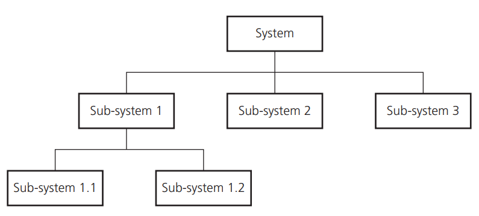
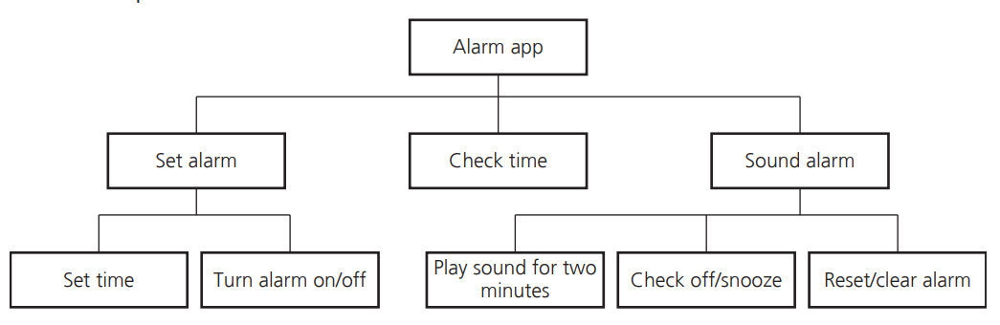
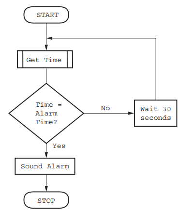

# 🖥️ Understanding Computer Systems and Their Sub-Systems

A **computer system** is a complex assembly made up of several components: **software, data, hardware, communications,** and **people**. Each computer system can be broken down into **sub-systems**, and each sub-system can be further divided until it performs a single, specific action.

Computer systems can vary in size, from very large to very small. Interestingly, most people interact with different computer systems daily without even realizing it. For instance, when you wake up, you might use an app on your smartphone as an alarm ⏰, and then check the weather forecast 🌦️ on your computer before heading to work. While the alarm program is a small computer system, checking the weather involves accessing one of the largest computer systems globally.

## The Computer System and Its Sub-Systems

To better understand how a computer system is constructed and functions, it is often divided into **sub-systems**. This division can be illustrated using **top-down design** to create **structure diagrams** that demonstrate the system's modular construction. Each sub-system can be developed by a programmer as a **sub-routine**.

- **Top-Down Design** 📐: This method involves decomposing a computer system into a set of sub-systems and then breaking down each sub-system into smaller sub-systems until each performs a single action. This approach, known as **stepwise refinement** 🧩, is highly effective in designing both large and small computer systems because it breaks down complex problems into manageable tasks.

- **Structured Approach** 🏗️: For larger systems, multiple programmers can independently develop and test different sub-systems simultaneously, reducing development and testing time.

## Decomposing a Problem

To solve a problem using a computer system, the problem needs to be **decomposed** into its component parts. The main components of any computer system are:

- **Inputs** ⌨️: The data used by the system that needs to be entered while the system is active.
- **Processes** ⚙️: The tasks performed using the input data and any other previously stored data.
- **Outputs** 🖨️: The information that needs to be displayed or printed for the users of the system.
- **Storage** 💾: Data that needs to be stored in files on an appropriate medium for future use.

### Example: An Alarm App ⏰

Let’s break down the **alarm app** as an example:

- **Inputs**: 
  - Set alarm time ⏲️
  - Remove a previously set alarm time ⏳
  - Switch off an alarm 🔕
  - Press the snooze button 😴
- **Processes**:
  - Continuously check if the current time matches a set alarm time 🕒
  - Store and remove alarm times 📝
  - Manage the snooze function 💤
- **Outputs**: 
  - Sound/tune 🎵 (at alarm time or after snooze time expires)
- **Storage**: 
  - Store times for the alarms set 📂

## Methods Used to Design and Construct a Solution 🛠️

Solutions to problems need to be designed and developed rigorously. Formal methods are essential to clearly show the process so others can understand the proposed solution. The following methods are used:

- **Structure Diagrams** 🏗️: These visually represent the breakdown of the system into sub-systems.
- **Flowcharts** 🔄: These depict the logical flow of tasks or processes within the system.
- **Pseudocode** 💻: This uses a simplified code-like language to describe the steps of the processes.

### 📊 What is a Structure Diagram?

A **structure diagram** is a hierarchical diagram that shows how a computer system solution is divided into sub-systems. Each level of the diagram gives a more detailed breakdown, making it easier to understand the system’s overall design. If necessary, each sub-system can be further divided into smaller sub-systems until the smallest functional units are identified.



#### 🔍 Breaking Down the Diagram

Let’s take a closer look at the structure diagram example provided:

1. **System**: 
   - The topmost box represents the entire system. This is the complete solution or program that you are designing.
   - Think of this as the "big picture" of what the system is meant to achieve.

2. **Sub-system 1, Sub-system 2, Sub-system 3**: 
   - These boxes represent the first level of decomposition, breaking the main system into major components or sub-systems.
   - Each sub-system is responsible for a specific part of the system’s functionality.

3. **Sub-system 1.1, Sub-system 1.2**:
   - These boxes represent the further decomposition of Sub-system 1. 
   - This level of detail is often necessary for understanding how the sub-systems will work together or separately.

#### 🌟 Example Explained

In the example diagram:

- The **System** is the entire project or software you are working on.
- The **Sub-systems** could be major modules of the project, such as:
  - **Sub-system 1**: Could be the user interface (UI).
  - **Sub-system 2**: Could be the backend processing.
  - **Sub-system 3**: Could be the database management.
  
- **Sub-system 1.1** and **Sub-system 1.2**:
  - These might represent smaller components within the user interface, such as the login screen and dashboard.

This approach allows you to visualize how each part of the system will function, making it easier to manage the complexity of large projects by breaking them down into manageable pieces.

#### 📚 Benefits of Using Structure Diagrams

- **Clarity**: Helps in visualizing the overall structure of the system.
- **Organization**: Breaks down complex systems into smaller, manageable parts.
- **Communication**: Provides a clear, easy-to-understand diagram that can be shared with stakeholders and team members.
- **Planning**: Assists in planning the development process by identifying the key components that need to be built.


### ⏰ Alarm App Structure Diagram Example 


#### 🔍 Breakdown of the Alarm App Structure Diagram

- **Alarm App**: This is the main system that ties together all the functionalities of the alarm application.

- **Set Alarm**:
  - **Set time**: The user interacts with this sub-system to choose what time they want the alarm to go off.
  - **Turn alarm on/off**: This allows the user to either activate the alarm or deactivate it if they no longer need it.

- **Check Time**:
  - **Play sound for two minutes**: This function is triggered when the system checks the current time and finds that it matches a set alarm time. The alarm sound is played for a duration of two minutes (or until the user intervenes).
  
- **Sound Alarm**:
  - **Check off/snooze**: Once the alarm is ringing, this sub-system gives the user options to either turn off the alarm or snooze it for a few more minutes.
  - **Reset/clear alarm**: After the alarm has been turned off, this sub-system clears the alarm settings or resets it if needed.

#### 🌟 Why is the Structure Diagram Useful?

- **Visualization**: It allows developers and users to easily visualize how the alarm app is structured, and understand how each part of the app contributes to its overall functionality.
- **Modular Design**: By breaking down the system into smaller sub-systems, it becomes easier to manage, develop, and troubleshoot the app. Each sub-system can be developed and tested independently.
- **Clarity**: This structure provides clarity in how different functionalities are divided and how they interact with each other.

#### 🛠️ Activity 7.2: Further Breakdown of "Check Time"

**Check Time** could be further divided into additional sub-systems:

- **Check Current Time**: Continuously monitors the current time on the device.
- **Match Time to Alarm**: Compares the current time to the times stored for active alarms.
- **Trigger Alarm Sound**: Activates the alarm sound if the current time matches an alarm time.
😊

### 🛠️ Understanding Flowcharts

**Flowcharts** are a visual tool used to represent the steps required to complete a task, along with the order in which these steps are performed. Each step in a flowchart is represented by a specific symbol, and the flow of the process is indicated by arrows connecting these symbols. Flowcharts are particularly useful for communicating how an algorithm, which is a sequence of steps or instructions, works within a system or sub-system.

<p align="center">
  
</p>

#### 🔍 Breakdown of the Alarm Flowchart

The provided flowchart illustrates the algorithm for a basic alarm system. Let’s break down each part of the flowchart:

1. **Start**:
   - The flowchart begins at the **Start** symbol, which indicates the starting point of the algorithm.

2. **Get Time**:
   - The first action is to **Get Time**. This step involves retrieving the current time, which will be compared to the alarm time.

3. **Decision: Time = Alarm Time?**:
   - This diamond-shaped symbol represents a decision point in the flowchart. The algorithm checks whether the current time matches the pre-set alarm time.
   - If **Yes**, the flow proceeds to the next step to **Sound Alarm**.
   - If **No**, the algorithm continues to the next step to **Wait 30 seconds** before checking the time again.

4. **Wait 30 seconds**:
   - If the current time does not match the alarm time, the algorithm waits for 30 seconds before looping back to check the time again.

5. **Sound Alarm**:
   - If the current time matches the alarm time, the **Sound Alarm** step is executed. This triggers the alarm to go off.

6. **Stop**:
   - After the alarm is sounded, the algorithm reaches the **Stop** symbol, indicating the end of the process.

#### 🌟 How Flowcharts Aid in Understanding Algorithms

- **Visualization**: Flowcharts provide a clear and easy-to-understand visualization of an algorithm, showing the sequence of steps and decision points.
- **Communication**: They are an effective way to communicate the workings of a system or sub-system, especially to people who may not be familiar with the underlying code.
- **Debugging**: Flowcharts can help in debugging by making it easier to see where errors might occur in the process.
- **Planning**: They are also useful during the planning phase of a project, as they help in mapping out the process before any code is written.

###  Pseudocode 💻

Here’s a simple pseudocode for the alarm app:

```pseudocode
BEGIN
    SET alarm_time ⏲️
    STORE alarm_time 💾
    WHILE current_time != alarm_time 🕒
        WAIT ⏳
    END WHILE
    TRIGGER alarm 🎵
    IF snooze_button_pressed THEN 😴
        WAIT for snooze_duration 💤
        REPEAT alarm ⏰
    ELSE
        STOP alarm 🔕
    END IF
END
```

### Python Code Alarm Example
```python
import time
from typing import TypedDict

# Define a TypedDict for the alarm time
class AlarmTime(TypedDict):
    hour: int
    minute: int

# Function to set an alarm time using Python 3.12 syntax
def set_alarm_time(hour: int, minute: int) -> AlarmTime:
    return {"hour": hour, "minute": minute}

# Function to check if the current time matches the alarm time
def check_time(alarm_time: AlarmTime) -> bool:
    current_time = time.localtime()
    return current_time.tm_hour == alarm_time["hour"] and current_time.tm_min == alarm_time["minute"]

# Function to trigger the alarm
def trigger_alarm() -> None:
    print("Alarm ringing! 🎵")

# Main function to manage the alarm app
def alarm_app(hour: int, minute: int) -> None:
    count = 0 
    alarm_time = set_alarm_time(hour, minute)
    print(f"Alarm set for {hour}:{minute:02d} ⏰")
    while True:
        print(f'Alarm Check Everytime {count}')
        if check_time(alarm_time):
            trigger_alarm()
            break
        time.sleep(2)  # Check every 5 seconds
        count = count + 1

# Example: Set an alarm for a specific time (24-hour format)
alarm_app(7, 0)  # Alarm set for 7:00 AM
```

### 🌟 Summary

Understanding computer systems and their sub-systems is crucial for designing effective solutions to problems. By breaking down a system into manageable sub-systems and using methods like structure diagrams, flowcharts, and pseudocode, we can ensure that each part of the system is well-defined and functions correctly. This structured approach is key to developing reliable and efficient computer systems, no matter their size. 🚀

