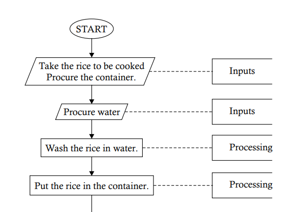
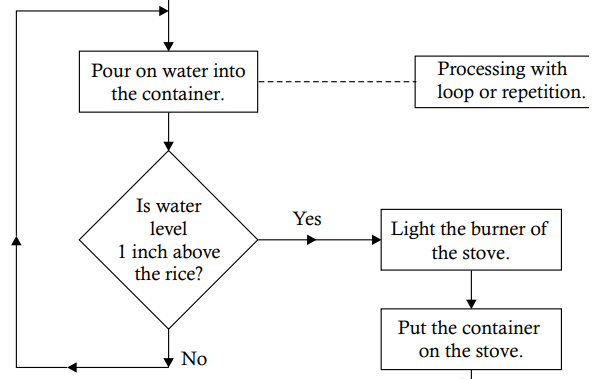
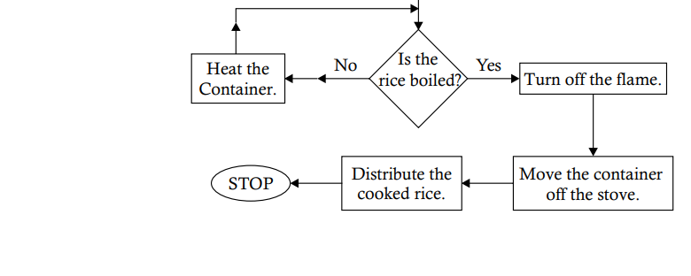

# 🍚 **Cooking Rice**
## 📜 **Algorithm (Steps) for Cooking Rice:**

1. **Get the rice** you want to cook. 🥄
2. **Get a container** to cook the rice in. 🍲
3. **Get some water** to wash and cook the rice. 🚰
4. **Wash the rice** in the water to clean it. 🧼
5. **Put the rice** into the container. 🍚
6. **Pour water** into the container with the rice. 💧
7. **Check if the water level** is about 1 inch above the rice. If yes, move to the next step. If not, add more water until it’s at the right level. 📏
8. **Turn on the stove** to start cooking the rice. 🔥
9. **Check if the rice is boiled.** If yes, move to the next step. If not, continue heating. 🥄
10. **Heat the container** until the rice is boiled. ♨️
11. **Go back to step 9** to check if the rice is boiled. 🔁
12. **Turn off the stove** once the rice is cooked. ❌🔥
13. **Move the container** off the stove. 🛑
14. **Distribute the cooked rice** for serving. 🍽️
15. **Stop.** The rice is ready! 🏁

<p align="center">
    
</p>
<p align="center">
    
</p>
<p align="center">
    
</p>

This flowchart visually represents the steps required to cook rice, following the sequence explained earlier. Here's a breakdown of what each part of the flowchart is showing:

1. **Start:**
   - The process begins with a START symbol, indicating the beginning of the cooking procedure.

2. **Input Steps:**
   - **Take the rice to be cooked.** (Input)
   - **Procure the container.** (Input)
   - **Procure water.** (Input)

3. **Processing Steps:**
   - **Wash the rice in water.** (Processing)
   - **Put the rice in the container.** (Processing)

4. **Processing with Loop:**
   - **Pour water into the container.**
     - A decision diamond asks, "Is water level 1 inch above the rice?"
     - **Yes:** Move on to the next step.
     - **No:** Continue pouring water until the water level is correct.

5. **Heat and Cook:**
   - **Light the burner of the stove.**
   - **Put the container on the stove.**

6. **Repetition for Cooking:**
   - A decision diamond checks, "Is the rice boiled?"
     - **Yes:** Move to the next steps.
     - **No:** Continue heating the container and go back to check if the rice is boiled.

7. **Final Steps:**
   - **Turn off the flame.**
   - **Move the container off the stove.**
   - **Distribute the cooked rice.**

8. **Stop:**
   - The process ends with a STOP symbol, indicating that the rice is ready.

### Python implementation of the cooking rice procedure:

```python
from typing import Literal

def get_rice(amount: float) -> float:
    """
    Simulate getting the rice to be cooked.
    :param amount: Amount of rice in cups.
    :return: The amount of rice.
    """
    return amount

def get_container() -> str:
    """
    Simulate getting a container to cook the rice.
    :return: A description of the container.
    """
    return "container for cooking rice"

def get_water(amount: float) -> float:
    """
    Simulate getting water.
    :param amount: Amount of water in cups.
    :return: The amount of water.
    """
    return amount

def wash_rice(rice: float, water: float) -> Literal[True]:
    """
    Simulate washing the rice.
    :param rice: The amount of rice.
    :param water: The amount of water used to wash the rice.
    :return: True, indicating the rice is washed.
    """
    print(f"Washed {rice} cups of rice with {water} cups of water.")
    return True

def pour_water_into_container(rice: float, water: float) -> Literal[True]:
    """
    Simulate pouring water into the container with the rice.
    :param rice: The amount of rice.
    :param water: The amount of water poured.
    :return: True, indicating the water is poured.
    """
    print(f"Poured {water} cups of water into the container with {rice} cups of rice.")
    return True

def check_water_level(rice: float, water: float) -> bool:
    """
    Check if the water level is 1 inch above the rice.
    :param rice: The amount of rice.
    :param water: The amount of water.
    :return: True if the water level is correct, False otherwise.
    """
    required_water = rice + 1  # Assuming 1 cup of rice needs 1 cup of water plus 1 inch more (approximated here)
    return water >= required_water

def turn_on_stove() -> Literal[True]:
    """
    Simulate turning on the stove.
    :return: True, indicating the stove is on.
    """
    print("Stove is turned on.")
    return True

def boil_rice() -> bool:
    """
    Simulate the process of boiling rice.
    :return: True if the rice is boiled, False otherwise.
    """
    # For simplicity, we'll assume the rice is always boiled after this function.
    print("Rice is boiling...")
    return True

def turn_off_stove() -> Literal[True]:
    """
    Simulate turning off the stove.
    :return: True, indicating the stove is off.
    """
    print("Stove is turned off.")
    return True

def move_container_off_stove() -> Literal[True]:
    """
    Simulate moving the container off the stove.
    :return: True, indicating the container is moved off.
    """
    print("Container is moved off the stove.")
    return True

def distribute_rice() -> Literal[True]:
    """
    Simulate distributing the cooked rice.
    :return: True, indicating the rice is distributed.
    """
    print("Cooked rice is distributed.")
    return True

def cook_rice_procedure(amount_of_rice: float, water_added: float) -> None:
    """
    Complete procedure for cooking rice.
    :param amount_of_rice: The amount of rice in cups.
    :param water_added: The amount of water in cups.
    """
    rice = get_rice(amount_of_rice)
    container = get_container()
    water = get_water(water_added)
    
    if wash_rice(rice, water):
        pour_water_into_container(rice, water)
        
        if check_water_level(rice, water):
            turn_on_stove()
            
            while not boil_rice():
                pass  # Continue heating until the rice is boiled
            
            turn_off_stove()
            move_container_off_stove()
            distribute_rice()

# Example usage
cook_rice_procedure(2.0, 3.5)
```

### 📝 **Explanation:**

1. **Type Hinting:** 
   - I used `Literal[True]` to indicate functions that return a literal value `True` to make it clear when a function succeeds.
   - Functions like `boil_rice()` use `bool` to indicate the possibility of returning `True` or `False`.

2. **Process Simulation:**
   - Each function simulates a step in the cooking process, similar to the flowchart.
   - The `cook_rice_procedure()` function combines all the steps, following the logic of the flowchart.

3. **Latest Python Features:**
   - The implementation uses Python 3.12’s latest type hinting and typing enhancements to create a clear and type-safe program.

4. **Example Use:**
   - The example usage `cook_rice_procedure(2.0, 3.5)` simulates cooking 2 cups of rice with 3.5 cups of water.