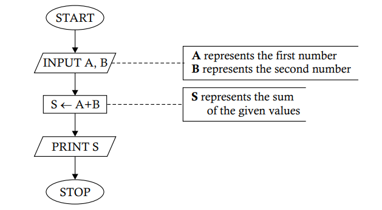

# Draw a flowchart to show how the sum of two numbers can be obtained.

## Step-by-Step Explanation

1. **START** 🟢
   - The process begins here. The program is initiated and ready to start its operation.

2. **INPUT A, B** 📝
   - Here, the program waits for the user to input two numbers:
     - **A** represents the first number.
     - **B** represents the second number.

3. **S ← A + B** ➕
   - The program now adds the two numbers together:
     - **S** is the variable that stores the sum of **A** and **B**.

4. **PRINT S** 🖨️
   - The program outputs the result:
     - It prints the value of **S**, which is the sum of the two numbers.

5. **STOP** 🔴
   - The program ends here. All operations are complete, and the program stops running.

### Summary
In this flowchart, the program simply takes two numbers, adds them together, and prints the result. It's a basic and straightforward example of how a simple addition operation can be represented visually in a flowchart. Perfect for understanding the basics of program flow! 😊