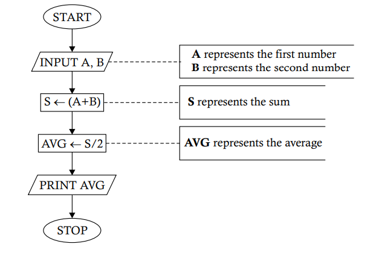

# `Problem 1.2`. Construct a flowchart to show the procedure for obtaining the average of two given numbers.
<p align="center">

</p>

1. **START** 🟢
   - The process begins here. The program is initiated and ready to start its operation.

2. **INPUT A, B** 📝
   - Here, the program waits for the user to input two numbers:
     - **A** represents the first number.
     - **B** represents the second number.

3. **S ← (A + B)** ➕
   - The program now adds the two numbers together:
     - **S** is the variable that stores the sum of **A** and **B**.

4. **AVG ← S / 2** ➗
   - The program calculates the average by dividing the sum (**S**) by 2:
     - **AVG** is the variable that stores the average of the two numbers.

5. **PRINT AVG** 🖨️
   - The program outputs the result:
     - It prints the value of **AVG**, which is the average of the two numbers.

6. **STOP** 🔴
   - The program ends here. All operations are complete, and the program stops running.

### Python Implementation 🐍

Here's how you can implement this flowchart in Python:

```python
# Start of the program

# Step 1: Input A and B
A = float(input("Enter the first number (A): "))  # 📝 User inputs the first number
B = float(input("Enter the second number (B): ")) # 📝 User inputs the second number

# Step 2: Calculate S = A + B
S = A + B  # ➕ S now holds the sum of A and B

# Step 3: Calculate AVG = S / 2
AVG = S / 2  # ➗ AVG now holds the average of the two numbers

# Step 4: Print the average
print(f"The average of {A} and {B} is: {AVG}")  # 🖨️ Print the average

# Stop the program
# 🔴 End of the program
```

### Explanation of the Code

1. **Input A and B** 📝
   - The program first asks the user to input two numbers, which are stored in variables `A` and `B`.
   - The `float()` function is used to allow decimal inputs as well.

2. **Calculate S = A + B** ➕
   - The sum of `A` and `B` is calculated and stored in the variable `S`.

3. **Calculate AVG = S / 2** ➗
   - The average is calculated by dividing the sum `S` by 2, and the result is stored in `AVG`.

4. **Print the result** 🖨️
   - Finally, the program prints the average, displaying it in a friendly message.

### Example Run
If you input `10` for `A` and `4` for `B`, the program will output:

```
The average of 10.0 and 4.0 is: 7.0
```