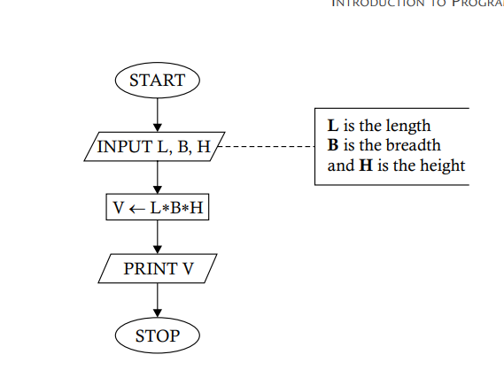

# `Problem 1.3` Construct a flowchart to show how to obtain the volume of a rectangular box., procedure for obtaining the average of two given numbers.
<p align="center">

</p>

1. **START** 🟢
   - The process begins here. The program is initiated and ready to start its operation.

2. **INPUT L, B, H** 📝
   - Here, the program waits for the user to input three values:
     - **L** represents the **length**.
     - **B** represents the **breadth**.
     - **H** represents the **height**.

3. **V ← L * B * H** 📦
   - The program now calculates the volume of the box:
     - **V** is the variable that stores the calculated volume, which is the product of **L**, **B**, and **H**.

4. **PRINT V** 🖨️
   - The program outputs the result:
     - It prints the value of **V**, which is the volume of the rectangular box.

5. **STOP** 🔴
   - The program ends here. All operations are complete, and the program stops running.

### Python Implementation 🐍

Here's how you can implement this flowchart in Python:

```python
# Start of the program

# Step 1: Input L, B, H
L = float(input("Enter the length (L): "))  # 📝 User inputs the length
B = float(input("Enter the breadth (B): ")) # 📝 User inputs the breadth
H = float(input("Enter the height (H): "))  # 📝 User inputs the height

# Step 2: Calculate V = L * B * H
V = L * B * H  # 📦 V now holds the volume of the box

# Step 3: Print the volume
print(f"The volume of the box is: {V}")  # 🖨️ Print the volume

# Stop the program
# 🔴 End of the program
```

### Explanation of the Code

1. **Input L, B, H** 📝
   - The program first asks the user to input three dimensions: length (`L`), breadth (`B`), and height (`H`).
   - The `float()` function allows for decimal inputs.

2. **Calculate V = L * B * H** 📦
   - The volume is calculated by multiplying the length (`L`), breadth (`B`), and height (`H`), and the result is stored in `V`.

3. **Print the result** 🖨️
   - Finally, the program prints the volume, displaying it in a friendly message.

### Example Run
If you input `2` for `L`, `3` for `B`, and `4` for `H`, the program will output:

```
The volume of the box is: 24.0
```
