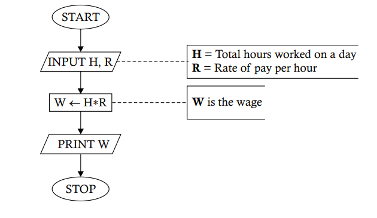

# `Problem 1.4` Construct a flowchart to show how to obtain the daily wage of a worker on the basis of the hours worked during the day.
<p align="center">

</p>

1. **START** 🟢
   - The process begins here. The program is initiated and ready to start its operation.

2. **INPUT H, R** 📝
   - Here, the program waits for the user to input two values:
     - **H** represents the **total hours** worked on a day.
     - **R** represents the **rate of pay** per hour.

3. **W ← H * R** 💰
   - The program now calculates the wage:
     - **W** is the variable that stores the calculated wage, which is the product of **H** (hours worked) and **R** (rate per hour).

4. **PRINT W** 🖨️
   - The program outputs the result:
     - It prints the value of **W**, which is the wage for the day.

5. **STOP** 🔴
   - The program ends here. All operations are complete, and the program stops running.

### Python Implementation 🐍

Here's how you can implement this flowchart in Python:

```python
# Start of the program

# Step 1: Input H and R
H = float(input("Enter the total hours worked (H): "))  # 📝 User inputs the total hours worked
R = float(input("Enter the rate of pay per hour (R): ")) # 📝 User inputs the rate per hour

# Step 2: Calculate W = H * R
W = H * R  # 💰 W now holds the wage for the day

# Step 3: Print the wage
print(f"The wage for the day is: {W}")  # 🖨️ Print the wage

# Stop the program
# 🔴 End of the program
```

### Explanation of the Code

1. **Input H and R** 📝
   - The program first asks the user to input two values: total hours worked (`H`) and rate of pay per hour (`R`).
   - The `float()` function allows for decimal inputs.

2. **Calculate W = H * R** 💰
   - The wage is calculated by multiplying the total hours worked (`H`) by the rate per hour (`R`), and the result is stored in `W`.

3. **Print the result** 🖨️
   - Finally, the program prints the wage, displaying it in a friendly message.

### Example Run
If you input `8` for `H` (total hours worked) and `15` for `R` (rate per hour), the program will output:

```
The wage for the day is: 120.0
```