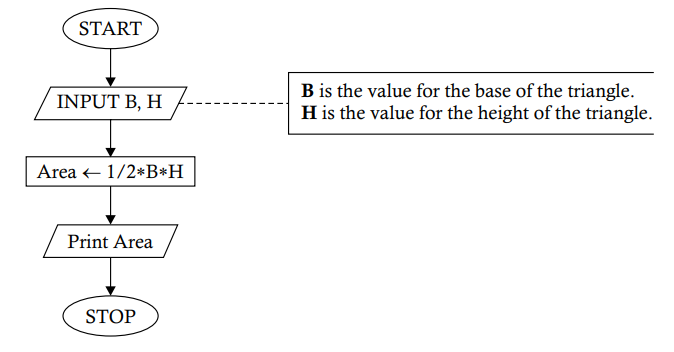

# `Problem 1.5` Construct a flowchart to show how to obtain the area of a triangle on the basis of the base and height.
<p align="center">

</p>

1. **START** 🟢
   - The process begins here. The program is initiated and ready to start its operation.

2. **INPUT B, H** 📝
   - Here, the program waits for the user to input two values:
     - **B** represents the **base** of the triangle.
     - **H** represents the **height** of the triangle.

3. **Area ← 1/2 * B * H** 📐
   - The program now calculates the area of the triangle:
     - **Area** is the variable that stores the calculated area, using the formula \( \text{Area} = \frac{1}{2} \times B \times H \).

4. **Print Area** 🖨️
   - The program outputs the result:
     - It prints the value of **Area**, which is the area of the triangle.

5. **STOP** 🔴
   - The program ends here. All operations are complete, and the program stops running.

### Python Implementation 🐍

Here's how you can implement this flowchart in Python:

```python
# Start of the program

# Step 1: Input B and H
B = float(input("Enter the base of the triangle (B): "))  # 📝 User inputs the base of the triangle
H = float(input("Enter the height of the triangle (H): ")) # 📝 User inputs the height of the triangle

# Step 2: Calculate Area = 1/2 * B * H
Area = 0.5 * B * H  # 📐 Area now holds the area of the triangle

# Step 3: Print the area
print(f"The area of the triangle is: {Area}")  # 🖨️ Print the area

# Stop the program
# 🔴 End of the program
```

### Explanation of the Code

1. **Input B and H** 📝
   - The program first asks the user to input two values: the base (`B`) and height (`H`) of the triangle.
   - The `float()` function allows for decimal inputs.

2. **Calculate Area = 1/2 * B * H** 📐
   - The area is calculated using the formula \( \text{Area} = \frac{1}{2} \times B \times H \), and the result is stored in `Area`.

3. **Print the result** 🖨️
   - Finally, the program prints the area, displaying it in a friendly message.

### Example Run
If you input `5` for `B` (base) and `10` for `H` (height), the program will output:

```
The area of the triangle is: 25.0
```