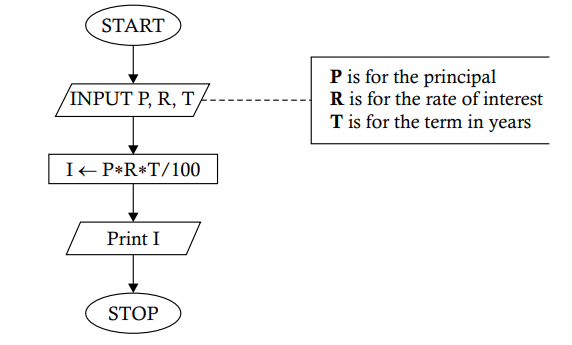

# `Problem 1.6` Develop a flowchart to show the steps in finding the simple interest on a given amount at a given rate of interest.
<p align="center">

</p>

1. **START** 🟢
   - The process begins here. The program is initiated and ready to start its operation.

2. **INPUT P, R, T** 📝
   - Here, the program waits for the user to input three values:
     - **P** represents the **principal** amount (the initial amount of money).
     - **R** represents the **rate of interest** per year.
     - **T** represents the **term** or time period in years.

3. **I ← P * R * T / 100** 💲
   - The program now calculates the simple interest:
     - **I** is the variable that stores the calculated interest, using the formula \( \text{I} = \frac{P \times R \times T}{100} \).

4. **Print I** 🖨️
   - The program outputs the result:
     - It prints the value of **I**, which is the simple interest for the given principal, rate, and time.

5. **STOP** 🔴
   - The program ends here. All operations are complete, and the program stops running.

### Python Implementation 🐍

Here's how you can implement this flowchart in Python:

```python
# Start of the program

# Step 1: Input P, R, T
P = float(input("Enter the principal amount (P): "))  # 📝 User inputs the principal amount
R = float(input("Enter the rate of interest per year (R): ")) # 📝 User inputs the rate of interest
T = float(input("Enter the time period in years (T): ")) # 📝 User inputs the time period

# Step 2: Calculate I = P * R * T / 100
I = (P * R * T) / 100  # 💲 I now holds the simple interest

# Step 3: Print the interest
print(f"The simple interest is: {I}")  # 🖨️ Print the simple interest

# Stop the program
# 🔴 End of the program
```

### Explanation of the Code

1. **Input P, R, T** 📝
   - The program first asks the user to input three values: principal amount (`P`), rate of interest (`R`), and time period (`T`).
   - The `float()` function allows for decimal inputs.

2. **Calculate I = P * R * T / 100** 💲
   - The simple interest is calculated using the formula \( \text{I} = \frac{P \times R \times T}{100} \), and the result is stored in `I`.

3. **Print the result** 🖨️
   - Finally, the program prints the simple interest, displaying it in a friendly message.

### Example Run
If you input `1000` for `P` (principal), `5` for `R` (rate), and `2` for `T` (time), the program will output:

```
The simple interest is: 100.0
```