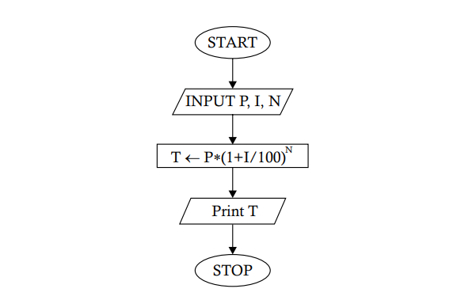

# `Problem 1.7` If P amount of money is invested for N years at an annual rate of interest I, the money grows to an amount T, where T is given by T = P (1 + I/100)N. Draw a flowchart to show how T is determined.
<p align="center">

</p>

1. **START** 🟢
   - The process begins here. The program is initiated and ready to start its operation.

2. **INPUT P, I, N** 📝
   - The program waits for the user to input three values:
     - **P** represents the **principal** amount (the initial amount of money).
     - **I** represents the **annual interest rate** (as a percentage).
     - **N** represents the **number of years** the money is invested or borrowed for.

3. **T ← P * (1 + I / 100)ⁿ** 📈
   - The program calculates the total amount using the compound interest formula:
     - **T** is the variable that stores the calculated amount after `N` years, using the formula \( T = P \times (1 + \frac{I}{100})^N \).

4. **Print T** 🖨️
   - The program outputs the result:
     - It prints the value of **T**, which is the total amount after applying compound interest.

5. **STOP** 🔴
   - The program ends here. All operations are complete, and the program stops running.

### Python Implementation 🐍

Here's how you can implement this flowchart in Python:

```python
# Start of the program

# Step 1: Input P, I, N
P = float(input("Enter the principal amount (P): "))  # 📝 User inputs the principal amount
I = float(input("Enter the annual interest rate (I) in percentage: ")) # 📝 User inputs the annual interest rate
N = int(input("Enter the number of years (N): "))  # 📝 User inputs the number of years

# Step 2: Calculate T = P * (1 + I / 100) ** N
T = P * (1 + I / 100) ** N  # 📈 T now holds the total amount after N years

# Step 3: Print the total amount
print(f"The total amount after {N} years is: {T}")  # 🖨️ Print the total amount

# Stop the program
# 🔴 End of the program
```

### Explanation of the Code

1. **Input P, I, N** 📝
   - The program first asks the user to input three values: principal amount (`P`), annual interest rate (`I`), and number of years (`N`).
   - The `float()` function allows for decimal inputs for the principal and interest rate, while `int()` is used for the number of years.

2. **Calculate T = P * (1 + I / 100) ** N** 📈
   - The total amount after `N` years is calculated using the compound interest formula \( T = P \times (1 + \frac{I}{100})^N \).
   - The result is stored in `T`.

3. **Print the result** 🖨️
   - Finally, the program prints the total amount, displaying it in a friendly message.

### Example Run
If you input `1000` for `P` (principal), `5` for `I` (interest rate), and `3` for `N` (years), the program will output:

```
The total amount after 3 years is: 1157.625
```