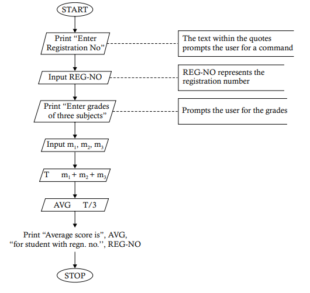

# `Problem 1.8` Construct a flowchart to show how a student’s registration number and grades in 3 subjects, m1, m2, and m3, are displayed along with the total average grade
<p align="center">

</p>

1. **START** 🟢
   - The process begins here. The program is initiated and ready to start its operation.

2. **Print "Enter Registration No"** 📝
   - The program prompts the user to enter the student's registration number.
   
3. **Input REG-NO** 🔢
   - The user inputs the registration number, which is stored in the variable **REG-NO**.

4. **Print "Enter grades of three subjects"** 📝
   - The program prompts the user to enter the grades for three subjects.

5. **Input m₁, m₂, m₃** 🎓
   - The user inputs the grades for the three subjects, stored in variables **m₁**, **m₂**, and **m₃**.

6. **T ← m₁ + m₂ + m₃** ➕
   - The program calculates the total score by adding the three grades:
     - **T** is the variable that stores the sum of **m₁**, **m₂**, and **m₃**.

7. **AVG ← T / 3** 📊
   - The program calculates the average score by dividing the total score **T** by 3:
     - **AVG** is the variable that stores the average score.

8. **Print "Average score is", AVG, "for student with regn. no.", REG-NO** 🖨️
   - The program prints a message that includes the average score **AVG** and the student's registration number **REG-NO**.

9. **STOP** 🔴
   - The program ends here. All operations are complete, and the program stops running.

### Python Implementation 🐍

Here's how you can implement this flowchart in Python:

```python
# Start of the program

# Step 1: Print the prompt for registration number
print("Enter Registration No")  # 📝 Prompt for registration number

# Step 2: Input REG-NO
REG_NO = input("Registration No: ")  # 🔢 User inputs the registration number

# Step 3: Print the prompt for grades
print("Enter grades of three subjects")  # 📝 Prompt for grades

# Step 4: Input grades m₁, m₂, m₃
m1 = float(input("Grade for subject 1: "))  # 🎓 User inputs grade for subject 1
m2 = float(input("Grade for subject 2: "))  # 🎓 User inputs grade for subject 2
m3 = float(input("Grade for subject 3: "))  # 🎓 User inputs grade for subject 3

# Step 5: Calculate T = m₁ + m₂ + m₃
T = m1 + m2 + m3  # ➕ T now holds the total of the three grades

# Step 6: Calculate AVG = T / 3
AVG = T / 3  # 📊 AVG now holds the average score

# Step 7: Print the average score with the registration number
print(f"Average score is {AVG} for student with regn. no. {REG_NO}")  # 🖨️ Print the average and reg. number

# Stop the program
# 🔴 End of the program
```

### Explanation of the Code

1. **Print "Enter Registration No"** 📝
   - The program prompts the user to enter the registration number.

2. **Input REG-NO** 🔢
   - The user inputs the registration number, which is stored in the variable `REG_NO`.

3. **Print "Enter grades of three subjects"** 📝
   - The program prompts the user to enter the grades for three subjects.

4. **Input m₁, m₂, m₃** 🎓
   - The user inputs the grades for the three subjects, stored in variables `m1`, `m2`, and `m3`.

5. **Calculate T = m₁ + m₂ + m₃** ➕
   - The total score is calculated by adding the grades together.

6. **Calculate AVG = T / 3** 📊
   - The average score is calculated by dividing the total score by 3.

7. **Print the result** 🖨️
   - Finally, the program prints a message that includes the average score and the student's registration number.

### Example Run
If you input `12345` for `REG_NO`, `80` for `m1`, `85` for `m2`, and `90` for `m3`, the program will output:

```
Average score is 85.0 for student with regn. no. 12345
```