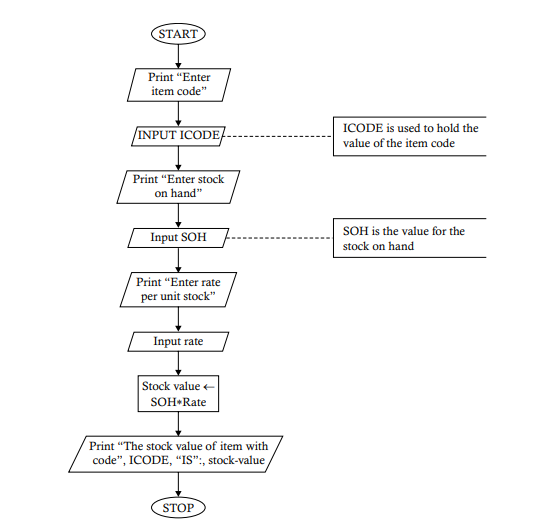

# `Problem 1.9`  Draw a flowchart to accept the item’s code, stock on hand, and the rate per unit of stock in a department store and display the stock value of the store.
<p align="center">

</p>

1. **START** 🟢
   - The process begins here. The program is initiated and ready to start its operation.

2. **Print "Enter item code"** 📝
   - The program prompts the user to enter the item code.

3. **Input ICODE** 🔢
   - The user inputs the item code, which is stored in the variable **ICODE**.

4. **Print "Enter stock on hand"** 📝
   - The program prompts the user to enter the quantity of stock on hand.

5. **Input SOH** 📦
   - The user inputs the stock on hand, stored in the variable **SOH**.

6. **Print "Enter rate per unit stock"** 📝
   - The program prompts the user to enter the rate per unit of the stock.

7. **Input rate** 💲
   - The user inputs the rate per unit, stored in the variable **rate**.

8. **Stock value ← SOH * rate** ➗
   - The program calculates the total stock value:
     - **Stock value** is the variable that stores the calculated value, which is the product of **SOH** (stock on hand) and **rate** (rate per unit).

9. **Print "The stock value of item with code", ICODE, "IS", stock-value** 🖨️
   - The program prints a message that includes the item code **ICODE** and the calculated stock value.

10. **STOP** 🔴
    - The program ends here. All operations are complete, and the program stops running.

### Python Implementation 🐍

Here's how you can implement this flowchart in Python:

```python
# Start of the program

# Step 1: Print the prompt for item code
print("Enter item code")  # 📝 Prompt for item code

# Step 2: Input ICODE
ICODE = input("Item Code: ")  # 🔢 User inputs the item code

# Step 3: Print the prompt for stock on hand
print("Enter stock on hand")  # 📝 Prompt for stock on hand

# Step 4: Input SOH
SOH = float(input("Stock on hand: "))  # 📦 User inputs the stock on hand

# Step 5: Print the prompt for rate per unit stock
print("Enter rate per unit stock")  # 📝 Prompt for rate per unit stock

# Step 6: Input rate
rate = float(input("Rate per unit: "))  # 💲 User inputs the rate per unit

# Step 7: Calculate Stock value = SOH * rate
stock_value = SOH * rate  # ➗ stock_value now holds the total stock value

# Step 8: Print the stock value with the item code
print(f"The stock value of item with code {ICODE} IS: {stock_value}")  # 🖨️ Print the stock value and item code

# Stop the program
# 🔴 End of the program
```

### Explanation of the Code

1. **Print "Enter item code"** 📝
   - The program prompts the user to enter the item code.

2. **Input ICODE** 🔢
   - The user inputs the item code, which is stored in the variable `ICODE`.

3. **Print "Enter stock on hand"** 📝
   - The program prompts the user to enter the quantity of stock on hand.

4. **Input SOH** 📦
   - The user inputs the stock on hand, stored in the variable `SOH`.

5. **Print "Enter rate per unit stock"** 📝
   - The program prompts the user to enter the rate per unit of the stock.

6. **Input rate** 💲
   - The user inputs the rate per unit, stored in the variable `rate`.

7. **Calculate Stock value = SOH * rate** ➗
   - The stock value is calculated by multiplying the stock on hand by the rate per unit, and the result is stored in `stock_value`.

8. **Print the result** 🖨️
   - Finally, the program prints a message that includes the item code and the calculated stock value.

### Example Run
If you input `A101` for `ICODE`, `50` for `SOH` (stock on hand), and `20` for `rate` (rate per unit), the program will output:

```
The stock value of item with code A101 IS: 1000.0
```
