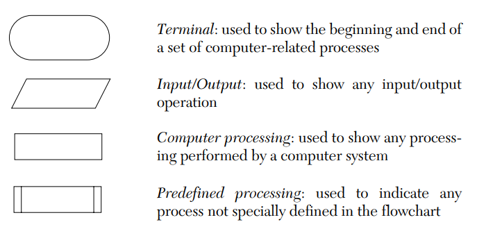
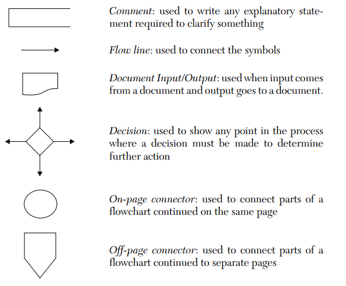

# The following are the standard symbols used in program flowcharts:

    

    

These images show the standard symbols used in program flowcharts, each representing a different part of a computer-related process. Below is a simple explanation of these symbols along with their meanings:

### 🛠️ **Standard Flowchart Symbols and Their Meanings**

1. **🔘 Terminal:**
   - **Shape:** Oval
   - **Use:** Indicates the start or end of a set of computer-related processes.

2. **🖥️ Input/Output:**
   - **Shape:** Parallelogram
   - **Use:** Represents any input (e.g., data entry) or output (e.g., printing) operation.

3. **⚙️ Computer Processing:**
   - **Shape:** Rectangle
   - **Use:** Depicts any processing function performed by a computer, such as calculations.

4. **🔄 Predefined Processing:**
   - **Shape:** Rectangle with double-struck sides
   - **Use:** Used to indicate a process that is defined elsewhere or is standard within the flowchart.

5. **💬 Comment:**
   - **Shape:** Rectangle (typically with a wavy edge on the bottom)
   - **Use:** Provides explanatory notes or comments within the flowchart for clarity.

6. **➡️ Flow Line:**
   - **Shape:** Arrow
   - **Use:** Connects symbols to show the direction of flow from one step to another.

7. **📄 Document Input/Output:**
   - **Shape:** A slanted rectangle with a curve at the bottom
   - **Use:** Represents input coming from or output going to a document.

8. **❓ Decision:**
   - **Shape:** Diamond
   - **Use:** Indicates a point in the process where a decision is made, typically resulting in branching paths.

9. **🔗 On-page Connector:**
   - **Shape:** Circle
   - **Use:** Connects different parts of the flowchart that are on the same page.

10. **🔗 Off-page Connector:**
    - **Shape:** Pentagon
    - **Use:** Connects parts of the flowchart that are continued on different pages.
